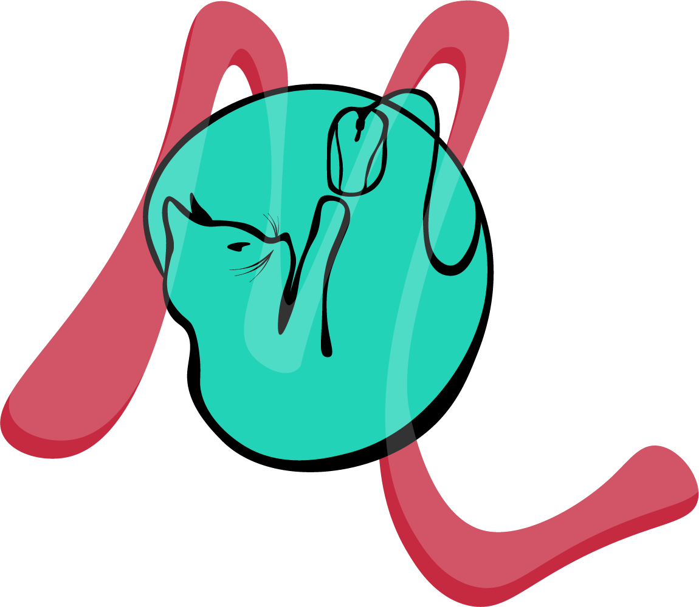

  

<h1 align="center">
  manonlespes.com - v2
</h1>

  The second iteration of <a href="https://manonlespes.com" target="_blank">manonlespes.com</a> built with <a href="https://fr.react.dev/" target="_blank">React</a>, <a href="https://daisyui.com/" target="_blank">daisyUi</a> - a Tailwind CSS Components librairy and <a href="https://v3.tailwindcss.com/" target="_blank">Tailwind V3</a>. It is currently hosted on <a href="https://www.o2switch.fr/" target="_blank">O2switch</a>.

  Previous iteration:
  <a href="https://github.com/manonlespes/MyWebsite-V1" target="_blank">v1</a>

